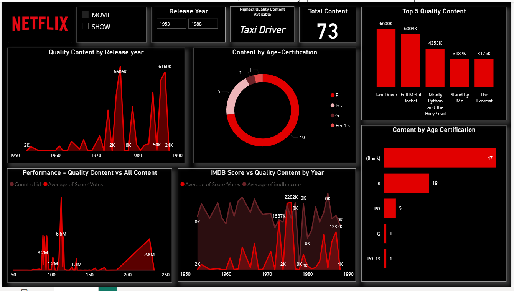

# 📊 Netflix Dashboard Project

This repository contains a dataset titled **"Like Netflix, TV shows, and movies.xlsx"** and a Power BI dashboard **Netflix.pbix**, created to analyze content available on Netflix. The goal is to provide insights into TV shows and movies by genre, release year, ratings, countries, and more.

---

## 📁 Files Included

- **Like Netflix, TV shows, and movies.xlsx**  
  The dataset in Excel format containing detailed information about Netflix titles, including:
  - Title  
  - Type (Movie or TV Show)  
  - Director  
  - Cast  
  - Country  
  - Date Added  
  - Release Year  
  - Rating  
  - Duration  
  - Genres  
  - Description  

- **Netflix.pbix**  
  A Power BI dashboard built using the above dataset. It provides interactive visuals and charts for exploring trends and patterns in Netflix content.

---

## 📸 Dashboard Screenshot

---

## 📈 Power BI Dashboard Features

The Power BI dashboard includes the following visuals and insights:

- 📅 **Content Release Over Time** – Analyze the number of movies and TV shows added by year.  
- 🌎 **Top Contributing Countries** – See which countries produce the most content available on Netflix.  
- 🎬 **Genre Distribution** – Breakdown of most popular genres by content type.  
- ⭐ **Rating Categories** – Distribution of content by ratings (e.g., TV-MA, PG-13, etc.).  
- ⏱️ **Duration Analysis** – Average duration of movies or number of seasons in TV shows.  
- 🔍 **Searchable Title Explorer** – Easily filter and search for individual shows or movies.

---

## 🛠️ How to Use

1. Download or clone this repository.
2. Open the dataset `Like Netflix, TV shows, and movies.xlsx` in Excel to explore the raw data.
3. Open `Netflix.pbix` in **Microsoft Power BI Desktop** to view and interact with the dashboard.
4. Optionally, refresh the data if changes are made to the Excel file.

---

## 📌 Dataset Source

The dataset is inspired by publicly available data about Netflix content. It may be a cleaned or modified version of the original dataset

---

## 👤 Author

**Aayush Dhote**

---

## 📝 License

This project is for educational and personal analysis purposes. Please check the original data source for licensing and usage terms.

If you like this project, ⭐️ the repository!
